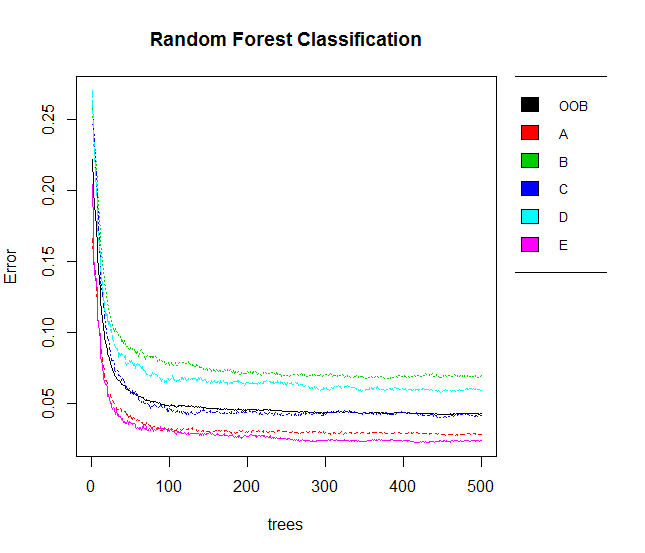

The purpose of the current project is to use data from accelerometers on the belt,
forearm, arm, and dumbell of 6 participants to predict how well they do a particular exercise.

Exploratory data analysis
------------------------

The training and test data sets are provided by <http://groupware.les.inf.puc-rio.br/har>. The training set consists of 19622 observations of 160 variables related to the 4 sensors in the belt,
forearm, arm and dumbell of 6 participants. The accelerometer variables in each sensor are 5 ( in total 20 for all accelerometer variables):

 * The total acceleration in every sensor
 
 * The variance of acceleration of each sensor
 
 * The acceleration in the x,y,z axis of each sensor

In each variable related with the variance of the acceleration, a 98% of the measurements is missing. Thus we decide to ignore the specific variables related to the accelerometers in our analysis. 
All remaining accelerometer variables (16 in total), which are used to predict variable *classe*, are integers. Furthermore, *classe* is a factor variable with levels A, B, C, D, E. Class A corresponds to the specified execution of the exercise, while the other 4 classes correspond to common mistakes. A histogram plot indicates that participants fail to execute correctly the exercise.

The analysis was performed with the aid of R version 3.1.1 in x86_64-w64-mingw32 machine, with the help of package **caret**.

Training and Predicition
------------------------
In the training set, a random forest is used to model the relation between variable *classe* and the 16 accelerometer predictors extracted as described in the previous section. In the constructed random forst, we enable the *out-of-bag* selection so that there is no need for cross-validation or a separate test set. 
Our model is built according to
```
modFit<-train(classe~.,data=pmlTrainingMod,method="rf",trControl=trainControl(method="oob"),importance=TRUE)

```
The optimal model is selected according to the largest value of *Accuracy*. A number of 500 trees are constructed with a split in each tree performed according to 2 out of 16 predictors. 
The confusion matrix of the random forest model is
```
Confusion matrix:
     A    B    C    D    E class.error
A 5422   29   59   65    5  0.02831541
B  126 3533   98   18   22  0.06952858
C   45   71 3280   23    3  0.04149620
D   54   10  113 3027   12  0.05876866
E    8   33   22   23 3521  0.02384253
```
The following figure illustrates the classification error in the training set for each constructed tree in the random forest. 


Classes B and D contribute most to the misclassification error in all trees. 
The figure below depicts the variable importance for the 16 predictors when the impurity metric is *Accuracy* and *Gini* respectively.


Finally, we note that the out-of-bag (oob) error estimate is considered as an unbiased estimate of the test set error. Thus we expect a 4.28% error rate in the test set.

The application of the random forest to the provided test set yields the following results
```
predict(modFit,newdata=pmlTesting)
 [1] B A C A A E D B A A B C B A E E A B B B
 Levels: A B C D E
```

Conclusion
------------------------
A random forest model has been trained to predict if 6 participants correctly execute a set of exercises. The prediction error rate of the model is 4.28%. The preprocessing of the training set with respect to scaling and centering has been tested and revealed a slight decrease in the error prediction rate. The employment of simplified models with the aid of the boosting technique is expected to yield better results. 
